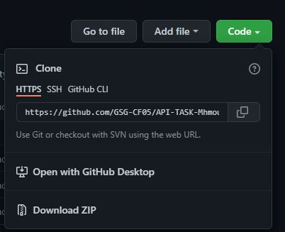

# API-TASK-MhmoudHammad
## Project description:

This  tiny website to get the top-rated movies from [TMDB API](https://www.themoviedb.org/documentation/api).

## Live link
[Click here](https://gsg-cf05.github.io/API-TASK-MhmoudHammad/)

## Cloning a repository

1. To navigate the main page of the repository [click here](https://github.com/GSG-CF05/API-TASK-MhmoudHammad).

2. Above the list of files, click Code.


3. To clone the repository using HTTPS.



4. Open Git Bash.

5. Change the current working directory to the location where you want the cloned directory.

6. Type ```git clone```, and then paste the URL you copied earlier.


7. Press **Enter** to create your local clone.


## created by: [Mahmoud Hammad](https://github.com/mahmoudhammad309)